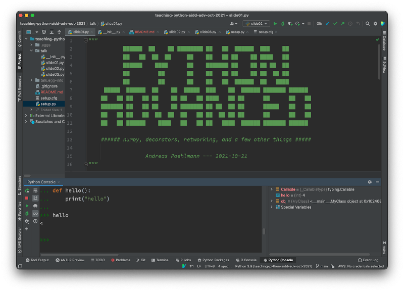
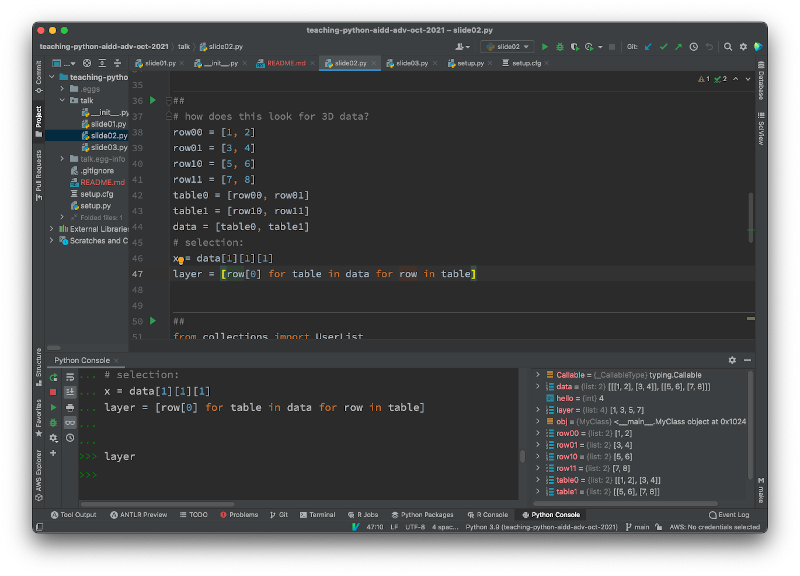

# Python Advanced --- numpy, decorators, networking (and more?)

Hello everyone :wave:

This is the project repo for the "Python Advanced - ..." introductory talk of the
AIDD Project's ([Advanced Machine Learning for Innovative Drug Discovery](https:/ai-dd.eu))
Summer School in Oct 2021.

The `talk` module in this repository contains the individual "slides" for each of
the sections of the presentation.

### "That's not a power-point presentation Andreas?!?"

I presented this talk in my PyCharm IDE. It's supposed to look like this:

The slides contain code that can be executed in a jupyter notebook like fashion
using the "Pycharm cell mode" plugin, which let's you mark sections of code for
execution as a cell via `##`:

### Live Session

The live session will happen on Thursday 2021-10-21 13:00h.

### Contribute

If you find mistakes, have questions or want to connect, just open an issue
in the repository :heart:
